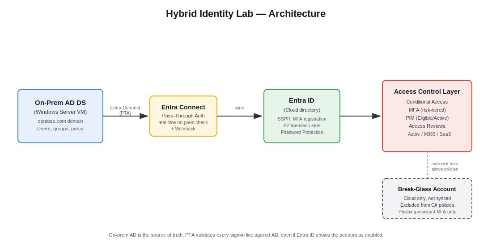
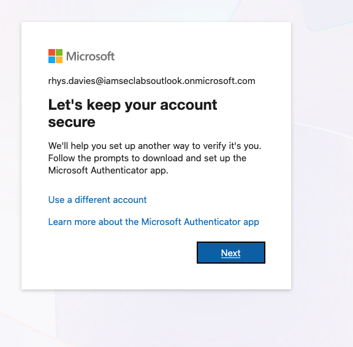
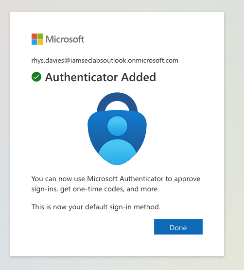
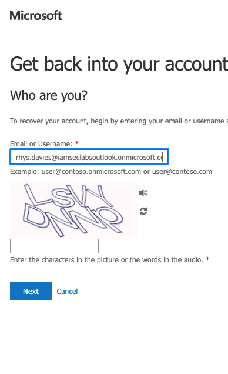
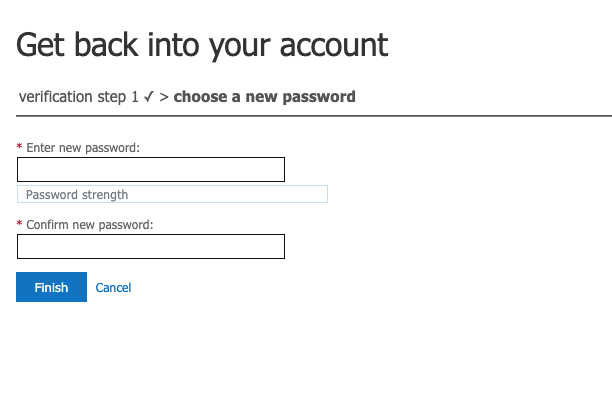
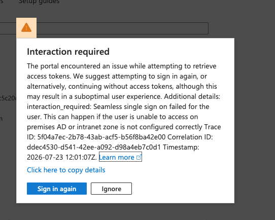
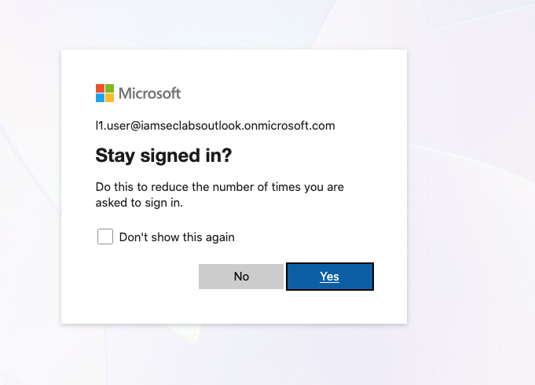
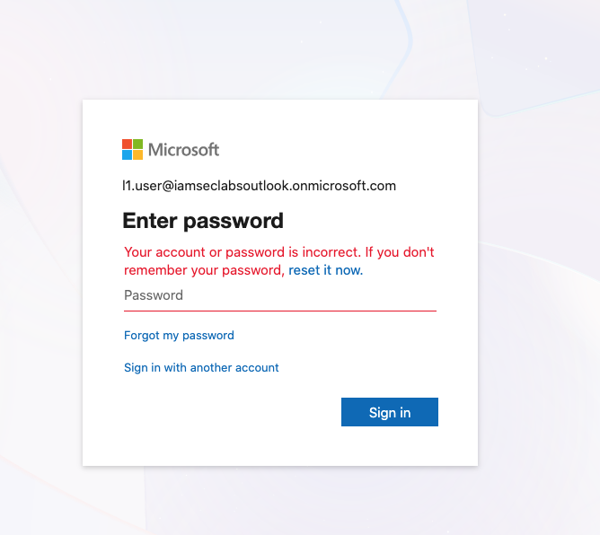

# Hybrid Identity — On-Prem AD & Entra ID Integration Lab

## Business Problem

Organisations modernising to the cloud rarely start with a clean slate — most still depend on legacy on-premises infrastructure (file servers, older line-of-business applications, payroll systems) that's tied to Active Directory, while also needing modern cloud applications secured through Entra ID. Maintaining two completely separate identity systems means employees hold two sets of credentials, IT manages two separate onboarding/offboarding processes, and access can drift out of sync between the two environments — creating both a poor user experience and a real security and audit risk.

## Solution Overview

Built a hybrid identity environment by deploying Active Directory Domain Services (AD DS) inside an Azure VM, then synchronising it to Microsoft Entra ID using Entra Connect/Cloud Sync. This creates a single, authoritative identity for each user that works consistently across both legacy on-premises systems and modern cloud applications — rather than maintaining separate, disconnected identities in each environment.

## Scope Note

This project focuses on establishing hybrid identity synchronisation between on-premises AD and Entra ID, and layering modern access controls (Conditional Access, MFA, PIM) on top of the synchronised identities.

[Placeholder — update as you decide what's in/out of scope, e.g. access reviews, full governance certification, covered separately elsewhere.]

## Architecture

()

## What I Built

**AD DS Setup:** Deployed a Windows Server 2025 VM in Azure to act as the on-premises domain controller — a practical lab substitute for physical on-prem hardware, achieving the same result. Promoted the server to a domain controller through the standard AD DS configuration process. Used `contoso.com` as the domain name — a reserved domain Microsoft specifically allows for lab and testing purposes, and the convention used throughout most of Microsoft's own documentation and training material. In a real enterprise deployment, an organisation would use its own owned and verified domain instead; `contoso.com` was used here since a custom domain wasn't available for this lab. Created users and groups within the new domain to represent a working directory structure, ready to be synchronised to the cloud.

**Entra Connect Configuration:** Downloaded the Entra Connect agent directly from the Microsoft Download Center onto the domain controller VM, then configured synchronisation through the Entra Connect configuration wizard. Confirmed the configuration completed successfully by checking Entra ID afterward and verifying that users synced correctly — covered in detail in the Sync Verification section below.

**Design consideration — Entra Connect vs. Cloud Sync:** Choosing between the traditional Entra Connect sync engine and the newer Cloud Sync agent-based approach is a genuine trade-off, not a fixed right answer. Entra Connect was used in this project specifically because it supports capabilities Cloud Sync doesn't: full configuration of Pass-Through Authentication (not available in Cloud Sync), granular Password Writeback configuration, and support for multiple forests within a single domain setup. Cloud Sync, by contrast, is lighter-weight and supports multiple agents for higher availability, making it a better fit for simpler environments that don't need this level of configurability. The right choice depends on the specific organisation's complexity and requirements — consistent with the broader theme running through this project: identity and access management decisions are rarely universally "correct," they're trade-offs weighed against a specific business context.

**Sync Verification:** Confirmed that user accounts created directly in on-premises AD DS synchronised successfully to Entra ID — verified by checking Entra ID's Users list and confirming the same accounts appear there automatically, without manual creation in the cloud.

*(Conditional Access, MFA, and PIM sections to be added as the lab progresses.)*

## Password Hash Synchronization (PHS)

**Business case:** Without hybrid identity, an employee would need separate credentials for on-premises resources and cloud/SaaS applications — one username and password to log into their on-prem-connected systems, and a completely different one for cloud apps like Microsoft 365 or other SaaS tools. This creates a worse user experience, more passwords to manage and forget, and more accounts for IT to secure. Password Hash Synchronization solves this by allowing an employee to use the same on-premises username and password to authenticate into cloud resources — a single identity, working consistently across both environments.

**What was built:** Configured Entra Connect to synchronise on-premises Active Directory with Entra ID, with Password Hash Synchronization enabled. This requires Entra Connect specifically — Password Hash Synchronization was enabled as part of the initial Entra Connect configuration wizard — not a separate step performed afterward, but a specific option selected during setup itself.

**A caveat worth naming:** this only works cleanly when the on-premises domain matches a verified domain in the Entra ID tenant. In this lab, the on-prem domain (`contoso.com`) doesn't match the tenant's original sign-up domain, so Entra Connect falls back to mapping synced users to the tenant's default `.onmicrosoft.com` domain instead. In a real enterprise deployment, the on-prem domain would typically be a verified, owned domain matching the cloud tenant, allowing a fully consistent sign-in experience across both environments.

**Verification:** Confirmed this worked correctly through three layers of proof, not just one:

1. **Sync** — users created directly in on-premises AD appeared automatically in both Entra ID and Azure, with no manual creation required in the cloud.
2. **Authentication** — logged in as one of these synced users via the `.onmicrosoft.com` UPN (per the domain caveat above) using the exact password set on-premises, and the login was accepted — confirming the password hash had synced correctly and could authenticate against Entra ID.
3. **Authorization** — assigned the user a Reader role in both Entra ID and Azure, then tested the boundary of that permission two ways: positively, by confirming the user could view users and subscriptions as expected; and negatively, by attempting to create a virtual machine, which was correctly blocked as an action Reader-level access doesn't permit. This negative test is the stronger proof — it confirms the permission boundary was genuinely enforced, not just that some access existed.

Together, these three layers confirm Password Hash Synchronization works end-to-end: a single on-premises identity, successfully synced, authenticated, and correctly authorized into cloud resources.

## Password Writeback

**Business case:** Without writeback, all password resets must happen on-premises — safer for keeping AD as the clear source of truth, but less convenient, since users can't self-serve and admins can't reset a synced user's password directly from the cloud. Writeback solves this by allowing password changes made in Entra ID (whether by an admin or via self-service reset) to sync back to on-premises AD, keeping both sides consistent. The trade-off: this is a deliberate, engineered exception to the normal one-directional flow of identity data (on-prem source → cloud) — introducing a controlled reversal of that direction, purely to enable convenience.

**Tested resilience point:** With PHS already handling authentication via a synced hash, stopping the on-premises AD VM entirely had no effect on sign-in for already-synced users — proving PHS-based authentication is genuinely independent of on-prem availability. Writeback, however, does depend on on-prem being reachable, since a cloud password change has nowhere to write back to if AD is offline.

**What was built:** Enabled writeback through the Entra Connect configuration wizard's Optional Features step, then separately enabled the linked setting in the Entra admin center (Identity → Protection → Password reset → On-premises integration) required for it to take effect with SSPR.

**Verification:** Confirmed the before/after behaviour directly: attempting a password reset while writeback was disabled failed with an authorisation error, consistent with the intended restriction. Once writeback was enabled, the same reset action succeeded, confirming the feature was correctly configured and functioning.

## Pass-Through Authentication (PTA)

**Business case:** Some organisations — particularly those in regulated industries or with strict data control requirements — have policies stating that credential data, even in hashed form, must never leave their own network. Pass-Through Authentication solves this: when a user signs in to a cloud app, the request is passed back to a lightweight agent on-premises, which validates the password directly against on-premises Active Directory in real time and returns a simple valid/invalid response — the password is never synced to or stored in the cloud at all.

**Operational risk — dependency and lockout:** Despite PTA's stronger data control, most organisations still choose PHS instead, because of a significant operational trade-off: if something goes wrong with the PTA agent, on-premises connectivity, or the Global Admin account used to configure it, authentication can fail across both environments simultaneously, with no built-in break-glass recovery process — resolving this may require raising a case with Microsoft support rather than fixing it directly.

**Switching sign-in methods is itself a risk point:** Microsoft's own documentation notes that changing away from PTA to another sign-in method disables PTA entirely and uninstalls the authentication agent — organisations are advised to have a backup authentication agent already running before making this change, to avoid breaking sign-in during the transition.

**What was built:** Configured PTA through the Entra Connect configuration wizard, under sign-in method, selecting Pass-Through Authentication — which automatically disables Password Hash Synchronization, since only one sign-in method can be active at a time.

## Password Policy Alignment — A Hybrid Governance Consideration

**Business case:** In a hybrid environment with writeback enabled, a password reset is checked against two separate policy engines in sequence — Entra ID's cloud policy first, then on-premises AD's policy — regardless of whether PHS or PTA is the sign-in method in use. If these two policies aren't deliberately kept in alignment (same minimum length, complexity requirements, etc.), the organisation ends up with genuinely inconsistent password rules depending on which system is asked. This is a real audit and governance risk — an auditor asking "what is your password policy" deserves a single, consistent answer, not "it depends which system you check."

**Why this isn't automatic:** Entra ID and on-premises AD are two separate products with independently-built policy engines — on-prem AD's policy model predates Entra ID by decades, and hybrid identity connects two systems that were never designed as one unified whole. Alignment has to be a deliberate configuration choice, not something that happens by default.

**A limitation worth noting:** the two policies can be aligned but never made fully identical — Entra ID always applies some cloud-specific protections (such as the global banned password list) that aren't configurable to match on-prem's specific rules, layering additional protection on top of an aligned baseline rather than replacing it.

**Takeaway:** good hybrid identity governance means treating password policy as a single, deliberately-aligned standard across both environments — not two independently-drifting policies that happen to coexist.

## Multi-Factor Authentication (MFA)

**Business case:** A password alone is a single point of failure — if it's phished, reused from a breached site, or guessed, an attacker has everything they need to access the account. MFA closes this gap by requiring a second, independent form of proof beyond the password — something the user has (an authenticator app, a FIDO2 key) or something they are (biometrics) — so a stolen password on its own is no longer sufficient to gain access. This significantly reduces successful account compromise, since the majority of real-world attacks rely on a stolen or guessed password working in isolation.

**What was built:** Configured MFA for test users using the Microsoft Authenticator app with number matching (rather than simple push approval), which specifically defends against MFA fatigue attacks — where an attacker who already has a valid password bombards the user with repeated approval prompts hoping they'll accept one out of frustration. Number matching requires the user to actively read and enter a number shown on screen, defeating that specific technique.

**Design consideration — MFA strength should scale with risk:** Not all MFA methods offer equal protection. SMS and voice codes are convenient but vulnerable to interception and SIM-swapping. Authenticator app push/number matching is stronger. Phishing-resistant methods (FIDO2 security keys, Windows Hello for Business) are the strongest, since they're cryptographically bound to the specific device and can't be tricked by a fake login page. A sensible design applies a baseline method (authenticator app) organisation-wide, while reserving phishing-resistant methods specifically for higher-risk actions — such as activating a privileged role via PIM — since the consequence of a compromised privileged account is far greater than a standard user account.

**A note on residual risk:** MFA dramatically reduces — but does not eliminate — account compromise risk. No single control, or combination of controls, removes risk entirely; layered controls (password, MFA, phishing-resistant methods for privileged access) each raise the cost and difficulty for an attacker, reducing risk to an acceptable, managed level rather than to zero. Against a highly resourced, persistent attacker, no configuration guarantees prevention — the realistic goal of any control is risk reduction, not risk elimination.

## Self-Service Password Reset (SSPR)

**Business case:** Without SSPR, a forgotten or locked-out password requires helpdesk involvement — a real problem for anyone working outside normal support hours (e.g., 2am), who would otherwise be completely blocked until the helpdesk reopens. SSPR solves this by letting users verify their own identity and reset their password themselves, at any time, without waiting for IT — reducing both user downtime and helpdesk ticket volume for what is typically one of the most common, repetitive support requests.

**A security consideration — verification method matters:** SSPR is only as secure as the method used to verify the user really is who they claim to be. Security questions were historically an option, but Microsoft is retiring them for SSPR in March 2027, explicitly because they're "often guessable or susceptible to social engineering, increasing the risk of account takeover during SSPR." This is exactly why the lab registers MFA as part of the SSPR setup process, rather than as a separate step — a self-service reset is only safe if the verification behind it is genuinely strong, since SSPR is, by definition, an unattended process with no human at the helpdesk double-checking the requester's identity.

**Hybrid environments and password policy conflict:** In a hybrid setup, a password reset via SSPR must satisfy both Entra ID's cloud policy and on-premises AD's policy (where writeback is enabled) — if it fails either, the reset fails and the user must fall back to a helpdesk-driven, on-premises reset instead. This creates a genuine design choice for organisations that want a single, unambiguous password policy: rather than running both cloud and on-prem policies side by side, an organisation could choose to disable SSPR and password reset in the cloud entirely, forcing all resets through on-premises AD. This keeps the identity lifecycle strictly single-sourced (matching the "AD as sole source of truth" principle established earlier in this project), at the cost of losing the convenience and reduced helpdesk load SSPR provides.

**Verified finding — licensing is a compliance requirement, not a technical gate:** Tested SSPR successfully on a user without a Microsoft Entra P2 license assigned. Microsoft's general licensing documentation states unlicensed users "may technically be able to access SSPR," though "a license is required for any user that you intend to benefit from the service" — a compliance/entitlement requirement, not a technical enforcement mechanism. This was directly confirmed against Microsoft's own official SC-300 training lab for this exact exercise, which contains no licensing step at all.

**Verified finding — administrator accounts use a separate, legacy SSPR system:** Attempting SSPR on an account holding an administrator role can fail with "password reset isn't turned on for your account," even when SSPR is correctly enabled for all standard users. This is a documented, specific behaviour — administrator accounts use a separate legacy configuration (SSPR-A) distinct from the standard user SSPR settings (SSPR-U) managed through the normal Entra admin center screen, and enabling SSPR for "All users" does not extend to administrator roles.
**Test 1 — Revoke sessions only:** Revoked the user's active session in Entra ID. Confirmed this does not block sign-in — it only forces re-authentication. Signing back in with the same, unchanged password succeeded immediately. Revoking sessions alone is not sufficient containment; it only interrupts current access, not future access.

## Emergency Account Revocation — Hybrid Environment (Cloud + On-Premises)

**Business case:** When an account is suspected of being compromised, a business needs a clear, defined strategy for containment — who acts (a SOC analyst detecting and escalating, versus an IAM analyst executing the actual remediation), and what steps are actually taken. Without a defined process, containment can be incomplete or inconsistent, especially in a hybrid environment where an identity exists in two separate systems.

**Approach for a cloud-only user:** Revoking the session is often not sufficient on its own — it only forces re-authentication, and since the account remains enabled with a valid password, the user (or an attacker) can simply sign back in immediately. The more effective action is disabling the account directly in Entra ID, which blocks all cloud/portal sign-in entirely.

**Approach for a synced (hybrid) user:** The same cloud-side steps apply, but they are not sufficient on their own. The account must also be disabled on-premises in Active Directory — either through the user's properties in Active Directory Users and Computers, or via a PowerShell script (`Disable-ADAccount`), whichever method suits the situation. Both achieve the same result.

**Verification testing:**

**Test 1 — Revoke sessions only:** Revoked the user's active session in Entra ID. Confirmed this does not block sign-in — it only forces re-authentication. Signing back in with the same, unchanged password succeeded immediately. Revoking sessions alone is not sufficient containment; it only interrupts current access, not future access.

**Test 2 — Disable in the cloud only:** Disabled the account in Entra ID. Confirmed this blocks cloud/portal sign-in entirely ("your account has been locked, contact your support person"). Checking the same account directly in on-premises Active Directory confirmed it remained fully enabled there. For a synced identity, disabling only in the cloud has no effect on-premises, leaving on-premises resources unaffected.

**Test 3 — Disable on-premises, with PTA as the sign-in method:** Re-enabled the account in Entra ID, then disabled it directly in on-premises AD. Attempting to sign in with the correct, known password failed cleanly with "your account or password is incorrect" — the generic error message Microsoft deliberately shows regardless of the actual cause, to avoid revealing to a potential attacker whether the block was due to a wrong password or a disabled account. Re-enabling the account on-premises again immediately restored successful sign-in with the same password, confirming the on-premises disabled status — not the password, and not the cloud-side flag — was the determining factor.

**Why this happened — PTA governs the outcome:** This lab uses Pass-Through Authentication rather than Password Hash Synchronization. With PTA, every sign-in attempt is validated live against on-premises AD, regardless of what the cloud-side enabled/disabled flag shows. This means an account can appear fully "enabled" in Entra ID and still be completely blocked from signing in if it's disabled on-premises — the on-premises status is the true, authoritative check, not the cloud's own record of it.

**Conclusion:** Proper incident containment for a compromised hybrid account requires disabling the account on-premises specifically, not just in the cloud — a cloud-only disable is insufficient with PTA in use, since it only blocks the cloud portal, not the underlying on-premises authentication check performed on every login.

**Note on automation:** In real enterprise environments, this remediation is often automated via SIEM/SOAR tooling (e.g., Microsoft Sentinel playbooks), which can call the Microsoft Graph API to disable an account in Entra ID and, for hybrid identities, use a Hybrid Worker to execute the same disable action directly against the on-premises domain controller. This project performed the same remediation manually, specifically to verify and understand the underlying mechanism directly, rather than relying on automated tooling as a black box.

## Troubleshooting & Problems I Hit

**Issue: Reader roles assigned but user had no access**

Assigned the test user (L1) Reader roles in both Entra ID and at the Azure subscription level, but on logging in as L1, I couldn't see any existing resources — Azure even prompted me to start a new free trial, as if the account had no relationship to the existing subscription at all.

Investigated by checking the role assignments directly and found both roles had been created as **Eligible** rather than **Active** — a PIM (Privileged Identity Management) setting. An Eligible assignment means the account is permitted to hold the role, but it isn't actually in effect until manually activated; nothing had been activated, so L1 genuinely had no access at all, despite the assignment technically existing.

Resolved by removing both eligible assignments and reassigning them as Active, which took effect immediately and was confirmed by logging in as L1 and successfully seeing the existing VM. This was a useful hands-on demonstration of a real PIM concept — access isn't standing by default, it must be deliberately granted or activated — rather than just a lab misconfiguration to fix and move past.

**Issue: SSPR failed with "password reset isn't turned on for your account"**

Attempted SSPR on a standard test user account and received the error: "You can't reset your own password because password reset isn't turned on for your account." The cause was straightforward — SSPR simply hadn't been correctly enabled/saved for that user at that point. Resolved by properly enabling password reset for the user and re-attempting.

**Issue: MFA verification code not received during SSPR**

While completing SSPR, was prompted to enter a verification code but received no push notification on the authenticator app. Checked mysignins.microsoft.com and confirmed the authenticator app registration appeared correctly listed and matched to the correct device, but push notifications still weren't arriving. Resolved by deleting the existing authenticator app registration entirely and re-authenticating from scratch — after which push notifications worked and the password reset completed successfully.

The precise root cause wasn't definitively confirmed. One possibility considered: MFA had originally been set up separately, before the SSPR process was configured, rather than both being done together in one continuous flow — it's possible this sequencing left the registration in an inconsistent state that only cleared once the method was removed and re-registered. This wasn't conclusively established, only that removing and re-registering resolved the issue.

**Update: Root cause of SSPR failure identified through re-testing**

After yesterday's SSPR troubleshooting (verification codes not arriving, "password reset isn't turned on" error), two hypotheses were formed to explain what went wrong:

1. **Hypothesis 1 — Authentication method targeting was never properly configured.** The top-level Authentication Methods Policy screen showed Microsoft Authenticator as "Enabled" with target "All users," which was assumed to mean the method was already active for everyone — reasonable, given Security Defaults already enforces MFA tenant-wide by default. This assumption was not verified by looking deeper into the method's actual configuration.

2. **Hypothesis 2 — MFA and SSPR registration were not completed together in one continuous flow.** Registering MFA separately, before returning later to configure SSPR, may have left the authenticator app registration in an inconsistent state, causing the verification code/push notification failures experienced yesterday.

**Test:** Removed the existing authenticator app registration entirely, both from the device and from the user's account. Went into the Authentication Methods Policy, clicked directly into Microsoft Authenticator, confirmed it was enabled, and explicitly set the target to the specific SSPR test group (rather than relying on the top-level "All users" summary). Then registered MFA and completed SSPR together, in one continuous flow, via the SSPR registration link.

**Result:** Registration and password reset completed successfully, with no errors and no missing verification codes.

**Conclusion:** Since both changes were made together in this single test, it isn't possible to say with certainty which of the two hypotheses was the actual cause, or whether both contributed. What is confirmed is that explicitly setting the authentication method's target (rather than trusting the top-level summary view) is necessary, and that registering MFA and SSPR together, in one flow, produced a clean result. This is a genuine, tested finding — not merely a theory — though the precise weighting between the two contributing factors remains undetermined without further isolated testing.

**Issue: Sign-in failure mistaken for a wrong password, actually caused by missing MFA registration**

During testing, a sign-in attempt failed even though the password was known to be correct. Checked the user's sign-in logs directly, which showed the failed attempt as **single-factor authentication**. Since Security Defaults enforces MFA tenant-wide with no exceptions, and this was the account's first-ever sign-in, the actual cause was that MFA had never been registered — not a wrong password, and not an account status issue. Signing in again correctly triggered the MFA registration flow, resolving it. This is a good example of using sign-in logs to identify the real cause of a failure rather than assuming based on a generic error message.
## Business Outcome

[Placeholder — to be completed once Conditional Access/MFA/PIM sections are built out.]

## References

Key Microsoft documentation used to verify technical claims in this project:

- [Active Directory Domain Services Overview](https://learn.microsoft.com/en-us/windows-server/identity/ad-ds/get-started/virtual-dc/active-directory-domain-services-overview)
- [Install Active Directory Domain Services](https://learn.microsoft.com/en-us/windows-server/identity/ad-ds/deploy/install-active-directory-domain-services--level-100-)
- [Microsoft Entra Connect: Prerequisites and Hardware](https://learn.microsoft.com/en-us/entra/identity/hybrid/connect/how-to-connect-install-prerequisites)
- [Microsoft Entra Connect Sync: Get Started Using Express Settings](https://learn.microsoft.com/en-us/entra/identity/hybrid/connect/how-to-connect-install-express)
- [Password Policy Overview and FAQ](https://learn.microsoft.com/en-us/entra/identity/authentication/tutorial-password-policy-overview-frequently-asked-questions)
- [On-premises Password Writeback with SSPR](https://learn.microsoft.com/en-us/entra/identity/authentication/concept-sspr-writeback)
- [Pass-Through Authentication FAQ](https://learn.microsoft.com/en-us/entra/identity/hybrid/connect/how-to-connect-pta-faq)
- ## References (MFA & SSPR)

- [Configure Security Defaults for Microsoft Entra ID](https://learn.microsoft.com/en-us/entra/fundamentals/security-defaults)
- [Enable Microsoft Entra Self-Service Password Reset](https://learn.microsoft.com/en-us/entra/identity/authentication/tutorial-enable-sspr)
- [Enable Microsoft Entra Password Writeback](https://learn.microsoft.com/en-us/entra/identity/authentication/tutorial-enable-sspr-writeback)
- [Self-Service Password Reset Licensing](https://learn.microsoft.com/en-us/entra/identity/authentication/concept-sspr-licensing)
- [Self-Service Password Reset Deep Dive](https://learn.microsoft.com/en-us/entra/identity/authentication/concept-sspr-howitworks)
- [Troubleshoot Self-Service Password Reset](https://learn.microsoft.com/en-us/entra/identity/authentication/troubleshoot-sspr)
- [Password Policy Overview and FAQ](https://learn.microsoft.com/en-us/entra/identity/authentication/tutorial-password-policy-overview-frequently-asked-questions)
- [Security Questions Authentication Method (Retirement Notice, March 2027)](https://learn.microsoft.com/en-us/entra/identity/authentication/concept-authentication-security-questions)
- [Microsoft Entra Administrators Can't Reset Their Own Password from Cloud (SSPR-A vs SSPR-U)](https://learn.microsoft.com/en-us/troubleshoot/entra/entra-id/user-prov-sync/password-writeback-error-code-sspr-009)
- [SC-300 Official Lab: Configure and Deploy Self-Service Password Reset](https://microsoftlearning.github.io/SC-300-Identity-and-Access-Administrator/Instructions/Labs/Lab_09_ConfigureAndDeploySelfServicePasswordReset.html)

*Note: the information above reflects Microsoft's documentation and product behaviour at the time this project was built. Microsoft Entra and Azure features are updated frequently, so some specifics may have changed since — the underlying identity and access management concepts, however, remain the core focus of this project.*

*(More references to be added as Conditional Access, MFA, and PIM sections are completed.)*
