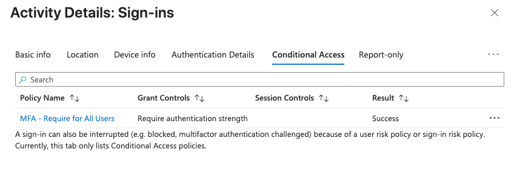

# Hybrid Identity — On-Prem AD & Entra ID Integration Lab

## Business Problem

Organisations modernising to the cloud rarely start with a clean slate. Most still rely on legacy on-premises infrastructure such as file servers, line-of-business applications, and payroll systems tied to Active Directory, while also needing cloud applications secured through Microsoft Entra ID. Running two separate identity systems creates duplicate credentials, duplicate onboarding and offboarding processes, and a real risk of access drifting out of sync between environments.
## Solution Overview

I built a hybrid identity environment by deploying Active Directory Domain Services (AD DS) inside an Azure VM and synchronising it to Microsoft Entra ID using Microsoft Entra Connect. This creates one identity for each user that works across both on-premises and cloud environments, rather than maintaining separate disconnected identities in each place.
## Scope Note

This project focuses on hybrid identity synchronisation between on-premises AD and Microsoft Entra ID, and on layering modern access controls such as Conditional Access, MFA, and PIM on top of those synchronised identities. Access reviews and entitlement certification are also included, as part of the broader identity governance workflow demonstrated in this lab.

## What I Built

**AD DS Setup:** I deployed a Windows Server 2025 VM in Azure to act as a practical stand-in for on-premises hardware, then promoted it to a domain controller using the standard AD DS configuration process. I used `contoso.com` as the domain name because it is a Microsoft testing convention and a reserved example domain commonly used in lab and training material. In a real deployment, the organisation would use its own verified domain. I then created users and groups in the domain to provide a working directory structure ready for cloud synchronisation.

**Entra Connect Configuration:** I downloaded Microsoft Entra Connect from the Microsoft Download Center onto the domain controller VM and configured synchronisation through the Entra Connect wizard. After configuration completed, I verified in Microsoft Entra ID that the users had synced successfully.

**Design consideration — Entra Connect vs. Cloud Sync:** I used Microsoft Entra Connect in this lab because it supports sign-in and synchronisation scenarios that are more fully featured than Cloud Sync in certain areas. Cloud Sync is lighter-weight and better suited to simpler or highly available deployments, while Entra Connect is still the better fit when you need the broader set of hybrid identity capabilities this lab is demonstrating. The choice is a trade-off, not a universal best answer, and depends on the organisation's requirements.

**Sync Verification:** I confirmed that users created on-premises in AD DS appeared automatically in Microsoft Entra ID without manual cloud creation.

### Password Hash Synchronization (PHS)

**Business case:** Without hybrid identity, employees typically need separate credentials for on-premises Active Directory and cloud services such as Microsoft 365. This increases the number of passwords users must remember and the number of identities IT must manage. Password Hash Synchronization (PHS) reduces this complexity by synchronizing a secure hash of the user's on-premises Active Directory password to Microsoft Entra ID, allowing users to sign in to both on-premises and cloud resources using the same username and password, while cloud authentication is performed by Microsoft Entra ID

**What was built:** Configured Entra Connect to synchronise on-premises Active Directory with Entra ID, with Password Hash Synchronization enabled. This requires Entra Connect specifically — Password Hash Synchronization was enabled as part of the initial Entra Connect configuration wizard — not a separate step performed afterward, but a specific option selected during setup itself.

**What was built:** I enabled Password Hash Synchronization during the Microsoft Entra Connect configuration wizard. This is part of the initial setup, not a separate later step.

Caveat: In this lab, the on-premises domain does not match the tenant’s original sign-up domain, so synced users fall back to the tenant’s .onmicrosoft.com domain for sign-in. In a real enterprise deployment, the on-premises domain would normally be a verified domain in the tenant, giving a more consistent sign-in experience.

**Verification:** I confirmed this worked at three levels: the users synced into Microsoft Entra ID, I could sign in as a synced user using the same password set on-premises, and I tested that Reader-level access behaved as expected by allowing viewing but blocking VM creation. That negative test was the strongest proof that the permission boundary was being enforced correctly.

1. **Sync** — users created directly in on-premises AD appeared automatically in both Entra ID and Azure, with no manual creation required in the cloud.
2. **Authentication** — logged in as one of these synced users via the `.onmicrosoft.com` UPN (per the domain caveat above) using the exact password set on-premises, and the login was accepted — confirming the password hash had synced correctly and could authenticate against Entra ID.
3. **Authorization** — assigned the user a Reader role in both Entra ID and Azure, then tested the boundary of that permission two ways: positively, by confirming the user could view users and subscriptions as expected; and negatively, by attempting to create a virtual machine, which was correctly blocked as an action Reader-level access doesn't permit. This negative test is the stronger proof — it confirms the permission boundary was genuinely enforced, not just that some access existed.

Together, these three layers confirm Password Hash Synchronization works end-to-end: a single on-premises identity, successfully synced, authenticated, and correctly authorized into cloud resources.

### Password Writeback

**Business case:** Without hybrid identity, employees typically need separate credentials for on-premises Active Directory and cloud services such as Microsoft 365. This increases the number of passwords users must remember and the number of user accounts IT must manage. Password Hash Synchronization (PHS) reduces this complexity by synchronizing a secure hash of the user's on-premises Active Directory password to Microsoft Entra ID. This enables users to sign in to both on-premises and cloud resources using the same username and password, while authentication for cloud resources is performed by Microsoft Entra ID.

**What was built:** I enabled password writeback through the Entra Connect configuration wizard and then enabled the related setting in the Microsoft Entra admin center under password reset integration.

**Verification:** I tested both states directly. When writeback was disabled, password reset failed as expected. Once enabled, the same reset completed successfully.

**Tested resilience point:** With PHS already handling authentication via a synced hash, stopping the on-premises AD VM entirely had no effect on sign-in for already-synced users — proving PHS-based authentication is genuinely independent of on-prem availability. Writeback, however, does depend on on-prem being reachable, since a cloud password change has nowhere to write back to if AD is offline.

**What was built:** Enabled writeback through the Entra Connect configuration wizard's Optional Features step, then separately enabled the linked setting in the Entra admin center (Identity → Protection → Password reset → On-premises integration) required for it to take effect with SSPR.

**Verification:** Confirmed the before/after behaviour directly: attempting a password reset while writeback was disabled failed with an authorisation error, consistent with the intended restriction. Once writeback was enabled, the same reset action succeeded, confirming the feature was correctly configured and functioning.

Pass-Through Authentication (PTA)

B**usiness case:** Some organisations have policies or regulatory requirements that prevent password hashes from being synchronised to the cloud. Pass-Through Authentication (PTA) addresses this by validating user sign-in requests against on-premises Active Directory in real time, without synchronising password hashes to Microsoft Entra ID.

Operational trade-off: PTA allows organisations to keep password validation on-premises, but it introduces a dependency on the on-premises environment and the Microsoft Entra authentication agents. If these components are unavailable, cloud authentication may be affected unless another sign-in method, such as Password Hash Synchronization, is configured. For many organisations, Password Hash Synchronization (PHS) remains the recommended option because it provides greater resilience and a simpler deployment, while still meeting the security requirements of most environments.

**What was built:** I configured PTA through the Entra Connect wizard. Because only one sign-in method can be active at a time, enabling PTA disables PHS.

### Password Policy Alignment

**Business case:** In a hybrid environment with writeback enabled, password resets must satisfy both cloud and on-premises password policy requirements. If the two policies drift apart, the organisation ends up with inconsistent password rules and confusing user experience.

**Why this matters:** Microsoft Entra ID and Active Directory are separate systems with separate policy engines. A clean hybrid design requires deliberate alignment, not assumptions that both sides will behave the same way automatically.

**Takeaway:** Good hybrid governance means treating password policy as one aligned standard across both environments, even though the platforms still have some differences.

### Password Policy Alignment

**Business case:** In a hybrid environment with writeback enabled, password resets must satisfy both cloud and on-premises password policy requirements. If the two policies drift apart, the organisation ends up with inconsistent password rules and confusing user experience.

**Why this matters:** Microsoft Entra ID and Active Directory are separate systems with separate policy engines. A clean hybrid design requires deliberate alignment, not assumptions that both sides will behave the same way automatically.

**Takeaway:** Good hybrid governance means treating password policy as one aligned standard across both environments, even though the platforms still have some differences.
### Multi-Factor Authentication (MFA)

**Business case:** A password alone is not enough. If it is phished, reused, or guessed, an attacker can log in without resistance. MFA adds a second factor so that a stolen password alone is not enough to gain access.

**What was built:** I configured MFA for test users using Microsoft Authenticator with number matching. This is stronger than simple push approval because it helps defend against MFA fatigue attacks.

**Design consideration:** Not all MFA methods are equal. Authenticator app-based MFA is stronger than SMS or voice, while phishing-resistant methods such as FIDO2 keys and Windows Hello for Business are stronger still. A sensible design uses the right method for the right risk.

**A note on residual risk:** MFA dramatically reduces — but does not eliminate — account compromise risk. No single control, or combination of controls, removes risk entirely; layered controls (password, MFA, phishing-resistant methods for privileged access) each raise the cost and difficulty for an attacker, reducing risk to an acceptable, managed level rather than to zero. Against a highly resourced, persistent attacker, no configuration guarantees prevention — the realistic goal of any control is risk reduction, not risk elimination.

### Self-Service Password Reset (SSPR)

**Business case:** Without SSPR, a user who forgets their password has to wait for helpdesk support. That creates avoidable downtime and support load. SSPR lets users verify their identity and reset their password themselves at any time.

**Security consideration:** SSPR is only as strong as the method used to verify identity. That is why I register MFA as part of the SSPR flow rather than treating it as a separate afterthought. A self-service reset is only safe if the verification method is strong enough.

**A security consideration — verification method matters:** SSPR is only as secure as the method used to verify the user really is who they claim to be. Security questions were historically an option, but Microsoft is retiring them for SSPR in March 2027, explicitly because they're "often guessable or susceptible to social engineering, increasing the risk of account takeover during SSPR." This is exactly why the lab registers MFA as part of the SSPR setup process, rather than as a separate step — a self-service reset is only safe if the verification behind it is genuinely strong, since SSPR is, by definition, an unattended process with no human at the helpdesk double-checking the requester's identity.

**Hybrid environments and password policy conflict:** In a hybrid setup, a password reset via SSPR must satisfy both Entra ID's cloud policy and on-premises AD's policy (where writeback is enabled) — if it fails either, the reset fails and the user must fall back to a helpdesk-driven, on-premises reset instead. This creates a genuine design choice for organisations that want a single, unambiguous password policy: rather than running both cloud and on-prem policies side by side, an organisation could choose to disable SSPR and password reset in the cloud entirely, forcing all resets through on-premises AD. This keeps the identity lifecycle strictly single-sourced (matching the "AD as sole source of truth" principle established earlier in this project), at the cost of losing the convenience and reduced helpdesk load SSPR provides.

**Verified finding — licensing is a compliance requirement, not a technical gate:** Tested SSPR successfully on a user without a Microsoft Entra P2 license assigned. Microsoft's general licensing documentation states unlicensed users "may technically be able to access SSPR," though "a license is required for any user that you intend to benefit from the service" — a compliance/entitlement requirement, not a technical enforcement mechanism. This was directly confirmed against Microsoft's own official SC-300 training lab for this exact exercise, which contains no licensing step at all.

**Verified finding — administrator accounts use a separate, legacy SSPR system:** Attempting SSPR on an account holding an administrator role can fail with "password reset isn't turned on for your account," even when SSPR is correctly enabled for all standard users. This is a documented, specific behaviour — administrator accounts use a separate legacy configuration (SSPR-A) distinct from the standard user SSPR settings (SSPR-U) managed through the normal Entra admin center screen, and enabling SSPR for "All users" does not extend to administrator roles.
**Test 1 — Revoke sessions only:** Revoked the user's active session in Entra ID. Confirmed this does not block sign-in — it only forces re-authentication. Signing back in with the same, unchanged password succeeded immediately. Revoking sessions alone is not sufficient containment; it only interrupts current access, not future access.
### Emergency Account Revocation — Hybrid Environment

**Business case:** When an account is suspected of being compromised, the business needs a clear containment process. In a hybrid environment, that means knowing whether the identity is cloud-only or synced, and acting in both places where necessary.

**Approach for a cloud-only user:** Revoking sessions alone is not enough, because the user can usually sign in again. Disabling the account in Microsoft Entra ID is the more effective containment action.

**Approach for a synced user:** The cloud-side action still matters, but the on-premises account also has to be disabled. In this lab, the sign-in method determines the exact behaviour, so the containment approach has to match the authentication model.

**Verification testing:**

**Test 1 — Revoke sessions only:** Revoked the user's active session in Entra ID. Confirmed this does not block sign-in — it only forces re-authentication. Signing back in with the same, unchanged password succeeded immediately. Revoking sessions alone is not sufficient containment; it only interrupts current access, not future access.

**Test 2 — Disable in the cloud only:** Disabled the account in Entra ID. Confirmed this blocks cloud/portal sign-in entirely ("your account has been locked, contact your support person"). Checking the same account directly in on-premises Active Directory confirmed it remained fully enabled there. For a synced identity, disabling only in the cloud has no effect on-premises, leaving on-premises resources unaffected.

**Test 3 — Disable on-premises, with PTA as the sign-in method:** Re-enabled the account in Entra ID, then disabled it directly in on-premises AD. Attempting to sign in with the correct, known password failed cleanly with "your account or password is incorrect" — the generic error message Microsoft deliberately shows regardless of the actual cause, to avoid revealing to a potential attacker whether the block was due to a wrong password or a disabled account. Re-enabling the account on-premises again immediately restored successful sign-in with the same password, confirming the on-premises disabled status — not the password, and not the cloud-side flag — was the determining factor.

**Why this happened — PTA governs the outcome:** This lab uses Pass-Through Authentication rather than Password Hash Synchronization. With PTA, every sign-in attempt is validated live against on-premises AD, regardless of what the cloud-side enabled/disabled flag shows. This means an account can appear fully "enabled" in Entra ID and still be completely blocked from signing in if it's disabled on-premises — the on-premises status is the true, authoritative check, not the cloud's own record of it.

**Conclusion:** Proper incident containment for a compromised hybrid account requires disabling the account on-premises specifically, not just in the cloud — a cloud-only disable is insufficient with PTA in use, since it only blocks the cloud portal, not the underlying on-premises authentication check performed on every login.

**Note on automation:** In real enterprise environments, this remediation is often automated via SIEM/SOAR tooling (e.g., Microsoft Sentinel playbooks), which can call the Microsoft Graph API to disable an account in Entra ID and, for hybrid identities, use a Hybrid Worker to execute the same disable action directly against the on-premises domain controller. This project performed the same remediation manually, specifically to verify and understand the underlying mechanism directly, rather than relying on automated tooling as a black box.

## Conditional Access

**Business case:** Traditional authentication methods, such as passwords and multifactor authentication (MFA), apply the same authentication requirements to every sign-in, regardless of the level of risk. Conditional Access enables organisations to enforce access policies based on signals such as the user, device, location, application, and sign-in risk. This allows organisations to apply Zero Trust principles by verifying each access request based on its context rather than relying on static authentication requirements alone.

**What a business typically needs to control:** At minimum, most organisations want to enforce MFA, restrict access by location, require stronger controls for privileged accounts, and block legacy authentication. That is the set of controls this lab is building toward.

**Policy 1 — Require MFA for all users:** I created a Conditional Access policy targeting all users except the break-glass accounts, scoped it to all resources, and required MFA as the grant control. I used report-only mode first, confirmed the policy with What If, then switched it on and verified the sign-in logs showed the policy applying correctly.
**Policy 1 — Require MFA for all users**

**What was built:** Created a Conditional Access policy targeting all users, with the two administrative break-glass accounts explicitly excluded to prevent lockout risk. Scoped to all resources, with a grant control requiring multifactor authentication (the general "Multifactor authentication" strength, not passwordless or phishing-resistant, since this is meant to be the organisation-wide baseline). The policy was first created and saved in Report-only mode.

Security Defaults was disabled first, since it can't coexist with an active Conditional Access policy, and the policy was then switched on.

**Verification:** Tested first using the built-in "What If" tool, confirming the policy would apply to a standard test user. Then created a brand-new, non-admin test user with no prior MFA registration.

Signed in as this new test user with the policy active — the sign-in correctly prompted for MFA registration and completed successfully.

Checked the sign-in log's Conditional Access tab directly for this event, which explicitly confirmed the policy had applied and MFA had been enforced through this Conditional Access policy specifically — not Security Defaults (already disabled) and not Microsoft's separate mandatory MFA enforcement for privileged accounts (this was a standard, non-admin user).

This is the way to actually confirm a Conditional Access policy is doing what it's supposed to, rather than just assuming it's working because MFA happened — since there are multiple separate ways MFA can get enforced in Entra ID, and only checking the policy's own status in the sign-in log tells you for certain it was this policy, specifically, that did it.
## Troubleshooting & Problems I Hit

### 1) Reader roles assigned, but user had no access

**Problem:**
I assigned the test user (L1) Reader roles in both Entra ID and at the Azure subscription level, but when I signed in as L1, I couldn't see any existing resources. Azure even acted as if the account had no relationship to the subscription at all and prompted me to start a new free trial.

**Investigation:**
I checked the role assignments directly and found that both roles had been created as Eligible rather than Active. That pointed to PIM being involved rather than a simple permissions issue.

**Cause:**
An Eligible assignment means the user is allowed to activate the role, but the role is not actually in effect until it is manually activated. Since nothing had been activated, L1 genuinely had no access.

**Fix:**
I removed both eligible assignments and reassigned them as Active. Once that was done, the access took effect immediately, and I confirmed it by signing in as L1 and successfully seeing the existing VM.

**Lesson learned:**
This was a useful reminder that in PIM, having a role assignment does not always mean having active access. The distinction between Eligible and Active is important, because access has to be deliberately granted or activated before it is actually usable.

### 2) SSPR failed with password reset not enabled

**Problem:**
When I attempted SSPR on a standard test user account, I got the message: "You can't reset your own password because password reset isn't turned on for your account."

**Investigation:**
I checked the configuration and confirmed that SSPR had not been properly enabled and saved for that user at that point.

**Cause:**
The user simply wasn't correctly included in the password reset configuration.

**Fix:**
I enabled password reset for the user properly and then tried again.

**Lesson learned:**
This showed me that SSPR is very dependent on the target configuration being correct. If the user or group targeting is not set properly, the feature will fail even if everything else looks fine.

### 3) MFA verification code not received during SSPR

**Problem:**
While completing SSPR, I was prompted to enter a verification code, but the push notification did not arrive on the authenticator app.

**Investigation:**
I checked mysignins.microsoft.com and confirmed that the authenticator app registration was showing correctly and matched to the correct device. Even so, the push notifications still were not working.

**Cause:**
The precise root cause was not confirmed at the time. One likely explanation was that MFA had originally been set up separately, before the SSPR process was configured, and that the registration ended up in an inconsistent state.

**Fix:**
I deleted the existing authenticator app registration completely and then re-registered from scratch. After that, the push notifications worked and the password reset completed successfully.

**Lesson learned:**
Sometimes the quickest fix is to remove the existing registration and start again cleanly. It also reinforced the importance of checking whether the identity method registration itself is healthy, not just whether it appears to exist.

### 4) Root cause of SSPR failure identified through re-testing

**Problem:**
After troubleshooting the SSPR issue, I wanted to confirm what had actually caused the verification code and password reset problems.

**Investigation:**
I formed two hypotheses: first, that the authentication method targeting had not been configured correctly; and second, that MFA and SSPR registration had not been completed together in one continuous flow. I removed the existing authenticator registration, then went into the Authentication Methods Policy, confirmed Microsoft Authenticator was enabled, and explicitly targeted the SSPR test group rather than relying on the top-level summary. I then registered MFA and completed SSPR together in a single flow.

**Cause:**
Because I changed both variables at once, I can't say with certainty which one was the exact cause. What I can confirm is that the explicit targeting and the single-flow registration both produced a clean result.

**Fix:**
I set the authentication method target properly and completed MFA and SSPR registration in one continuous process.

**Lesson learned:**
This was a good lesson in not trusting a top-level summary view alone. It also showed me that when testing identity workflows, the order of registration can matter, and that clean re-registration can resolve issues that are hard to diagnose from symptoms alone.

### 5) Sign-in failure mistaken for wrong password

**Problem:**
A sign-in attempt failed even though I knew the password was correct.

**Investigation:**
I checked the user's sign-in logs directly and saw that the failed attempt was recorded as single-factor authentication. Since Security Defaults enforces MFA tenant-wide, I realised this was the account's first sign-in and MFA had never been registered.

**Cause:**
The real issue was not the password or the account state — it was missing MFA registration.

**Fix:**
I signed in again, which correctly triggered the MFA registration flow, and the issue was resolved.

**Lesson learned:**
This reinforced the value of sign-in logs. The error message itself was not enough to explain the failure, but the logs showed the actual reason quickly. In IAM, you have to work from evidence, not assumptions.
[Placeholder — to be completed once Conditional Access/MFA/PIM sections are built out.]

## References

Key Microsoft documentation used to verify technical claims in this project:

- [Active Directory Domain Services Overview](https://learn.microsoft.com/en-us/windows-server/identity/ad-ds/get-started/virtual-dc/active-directory-domain-services-overview)
- [Install Active Directory Domain Services](https://learn.microsoft.com/en-us/windows-server/identity/ad-ds/deploy/install-active-directory-domain-services--level-100-)
- [Microsoft Entra Connect: Prerequisites and Hardware](https://learn.microsoft.com/en-us/entra/identity/hybrid/connect/how-to-connect-install-prerequisites)
- [Microsoft Entra Connect Sync: Get Started Using Express Settings](https://learn.microsoft.com/en-us/entra/identity/hybrid/connect/how-to-connect-install-express)
- [Password Policy Overview and FAQ](https://learn.microsoft.com/en-us/entra/identity/authentication/tutorial-password-policy-overview-frequently-asked-questions)
- [On-premises Password Writeback with SSPR](https://learn.microsoft.com/en-us/entra/identity/authentication/concept-sspr-writeback)
- [Pass-Through Authentication FAQ](https://learn.microsoft.com/en-us/entra/identity/hybrid/connect/how-to-connect-pta-faq)
- ## References (MFA & SSPR)

- [Configure Security Defaults for Microsoft Entra ID](https://learn.microsoft.com/en-us/entra/fundamentals/security-defaults)
- [Enable Microsoft Entra Self-Service Password Reset](https://learn.microsoft.com/en-us/entra/identity/authentication/tutorial-enable-sspr)
- [Enable Microsoft Entra Password Writeback](https://learn.microsoft.com/en-us/entra/identity/authentication/tutorial-enable-sspr-writeback)
- [Self-Service Password Reset Licensing](https://learn.microsoft.com/en-us/entra/identity/authentication/concept-sspr-licensing)
- [Self-Service Password Reset Deep Dive](https://learn.microsoft.com/en-us/entra/identity/authentication/concept-sspr-howitworks)
- [Troubleshoot Self-Service Password Reset](https://learn.microsoft.com/en-us/entra/identity/authentication/troubleshoot-sspr)
- [Password Policy Overview and FAQ](https://learn.microsoft.com/en-us/entra/identity/authentication/tutorial-password-policy-overview-frequently-asked-questions)
- [Security Questions Authentication Method (Retirement Notice, March 2027)](https://learn.microsoft.com/en-us/entra/identity/authentication/concept-authentication-security-questions)
- [Microsoft Entra Administrators Can't Reset Their Own Password from Cloud (SSPR-A vs SSPR-U)](https://learn.microsoft.com/en-us/troubleshoot/entra/entra-id/user-prov-sync/password-writeback-error-code-sspr-009)
- [SC-300 Official Lab: Configure and Deploy Self-Service Password Reset](https://microsoftlearning.github.io/SC-300-Identity-and-Access-Administrator/Instructions/Labs/Lab_09_ConfigureAndDeploySelfServicePasswordReset.html)

*Note: the information above reflects Microsoft's documentation and product behaviour at the time this project was built. Microsoft Entra and Azure features are updated frequently, so some specifics may have changed since — the underlying identity and access management concepts, however, remain the core focus of this project.*

*(More references to be added as Conditional Access, MFA, and PIM sections are completed.)*
