# Hybrid Identity — On-Prem AD & Entra ID Integration Lab

**Business Problem:** Most organisations still run on-prem Active Directory alongside cloud services like Microsoft Entra ID. On-prem AD is still widely used today for things like file shares and internal network resources, while businesses also want to use cloud apps and services. The problem is connecting those two properly and managing them together, rather than running them as two separate, disconnected systems. Without that, you end up with duplicate credentials, duplicate onboarding/offboarding processes, and access that can drift out of sync between the two environments.

**Solution Overview:** The solution is one identity per user that works across both on-prem AD and the cloud, rather than having separate, disconnected identities in each place — whether that identity was originally created on-prem or in the cloud. I built this by deploying Active Directory Domain Services (AD DS) inside an Azure VM and synchronising it to Microsoft Entra ID using Microsoft Entra Connect.

**Scope Note:** This lab currently covers hybrid identity between on-prem Active Directory and Microsoft Entra ID, built using Entra Connect for synchronisation, with Conditional Access, MFA, and PIM layered on top as access controls. This is an ongoing project alongside my SC-300 studies, so further areas — such as identity governance and access reviews — will be added as they're built out.

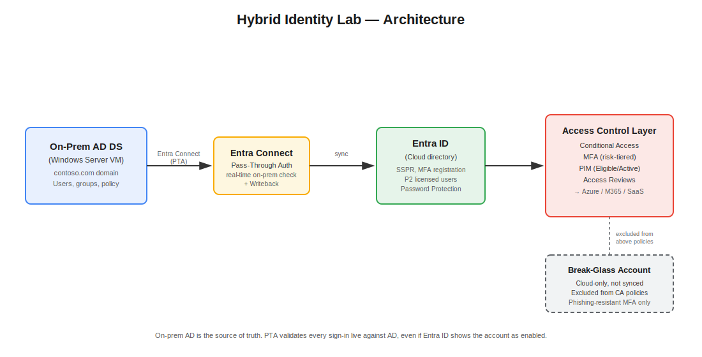

## What I Built

**AD DS Setup:** I deployed a Windows Server 2025 VM in Azure to act as a practical stand-in for on-premises hardware, then promoted it to a domain controller using the standard AD DS configuration process. I used `contoso.com` as the domain name because it is a Microsoft testing convention and a reserved example domain commonly used in lab and training material. In a real deployment, the organisation would use its own verified domain. I then created users and groups in the domain to provide a working directory structure ready for cloud synchronisation.

**Entra Connect Configuration:** I downloaded Microsoft Entra Connect from the Microsoft Download Center onto the domain controller VM and configured synchronisation through the Entra Connect wizard. After configuration completed, I verified in Microsoft Entra ID that the users had synced successfully.

**Design consideration — Entra Connect vs. Cloud Sync:** I went with Entra Connect for this lab because on-prem AD was the main focus, and Entra Connect has a broader feature set for that kind of setup. If most of an organisation's stuff was already in the cloud, Cloud Sync would probably make more sense instead — it's lighter weight. Basically it depends on where the bulk of your infrastructure actually sits — on-prem or cloud — and each option has its own pros and cons depending on that.

**Sync Verification:** I confirmed that users created on-premises in AD DS appeared automatically in Microsoft Entra ID without manual cloud creation.

### Password Hash Synchronization (PHS)

**Business case:** Without hybrid identity, employees typically need separate credentials for on-premises Active Directory and cloud services such as Microsoft 365. This increases the number of passwords users must remember and the number of identities IT must manage. Password Hash Synchronization (PHS) reduces this complexity by synchronizing a secure hash of the user's on-premises Active Directory password to Microsoft Entra ID, allowing users to sign in to both on-premises and cloud resources using the same username and password, while cloud authentication is performed by Microsoft Entra ID.

**What was built:** Password Hash Synchronization is enabled by default in the Entra Connect wizard — it's ticked automatically when you set up the sync. I confirmed this myself later, when I went back in to switch the sign-in method over to Pass-Through Authentication instead, which showed me PHS had been the default option all along.

**Caveat:** In this lab, the on-premises domain does not match the tenant's original sign-up domain, so synced users fall back to the tenant's .onmicrosoft.com domain for sign-in. In a real enterprise deployment, the on-premises domain would normally be a verified domain in the tenant, giving a more consistent sign-in experience.

**Verification:** I confirmed this worked at three levels: the users synced into Microsoft Entra ID, I could sign in as a synced user using the same password set on-premises, and I tested that Reader-level access behaved as expected by allowing viewing but blocking VM creation. That negative test was the strongest proof that the permission boundary was being enforced correctly.

1. **Sync** — users created directly in on-premises AD appeared automatically in both Entra ID and Azure, with no manual creation required in the cloud.
2. **Authentication** — logged in as one of these synced users via the `.onmicrosoft.com` UPN (per the domain caveat above) using the exact password set on-premises, and the login was accepted — confirming the password hash had synced correctly and could authenticate against Entra ID.
3. **Authorization** — assigned the user a Reader role in both Entra ID and Azure, then tested the boundary of that permission two ways: positively, by confirming the user could view users and subscriptions as expected; and negatively, by attempting to create a virtual machine, which was correctly blocked as an action Reader-level access doesn't permit. This negative test is the stronger proof — it confirms the permission boundary was genuinely enforced, not just that some access existed.

Together, these three layers confirm Password Hash Synchronization works end-to-end: a single on-premises identity, successfully synced, authenticated, and correctly authorized into cloud resources.

### Password Writeback

**Business case:** In a hybrid environment, if a user resets their password from the cloud side — either themselves or through SSPR — you need that change to actually make it back to on-prem AD, otherwise the two environments fall out of sync and the user ends up with different passwords in each place. Password Writeback solves this by pushing a cloud-side password reset back down to on-prem AD, keeping both environments aligned.

**What was built:** Enabled writeback through the Entra Connect configuration wizard's Optional Features step, then separately enabled the linked setting in the Entra admin center (Identity → Protection → Password reset → On-premises integration), which is needed for it to actually work with SSPR.

**Verification:** Tested both states directly — with writeback disabled, a password reset failed with an authorisation error as expected. Once I enabled it, the same reset completed successfully.

**Tested resilience point:** With PHS already handling authentication via a synced hash, stopping the on-prem AD VM entirely had no effect on sign-in for already-synced users — proving PHS-based authentication is genuinely independent of on-prem availability. Writeback, though, does depend on on-prem being reachable, since a cloud password change has nowhere to write back to if AD is offline.

Pass-Through Authentication (PTA)

**Business case:** Some organisations have policies or regulatory requirements that prevent password hashes from being synchronised to the cloud. Pass-Through Authentication (PTA) addresses this by validating user sign-in requests against on-premises Active Directory in real time, without synchronising password hashes to Microsoft Entra ID.

Operational trade-off: PTA allows organisations to keep password validation on-premises, but it introduces a dependency on the on-premises environment and the Microsoft Entra authentication agents. If these components are unavailable, cloud authentication may be affected unless another sign-in method, such as Password Hash Synchronization, is configured. For many organisations, Password Hash Synchronization (PHS) remains the recommended option because it provides greater resilience and a simpler deployment, while still meeting the security requirements of most environments.

**What was built:** I configured PTA through the Entra Connect wizard. Because only one sign-in method can be active at a time, enabling PTA disables PHS.

### Password Policy Alignment

**Business case:** In a hybrid environment with writeback enabled, password resets must satisfy both cloud and on-premises password policy requirements. If the two policies drift apart, the organisation ends up with inconsistent password rules and confusing user experience.

**Why this matters:** Microsoft Entra ID and Active Directory are separate systems with separate policy engines. A clean hybrid design requires deliberate alignment, not assumptions that both sides will behave the same way automatically.

**Takeaway:** Good hybrid governance means treating password policy as one aligned standard across both environments, even though the platforms still have some differences.
### Multi-Factor Authentication (MFA)

**Business case:** A password alone is not enough. If it is phished, reused, or guessed, an attacker can log in without resistance. MFA adds a second factor so that a stolen password alone is not enough to gain access.

**What was built:** I configured MFA for test users using Microsoft Authenticator with number matching. This is stronger than simple push approval because it helps defend against MFA fatigue attacks.

**Design consideration:** Not all MFA methods are equal. Authenticator app-based MFA is stronger than SMS or voice, while phishing-resistant methods such as FIDO2 keys and Windows Hello for Business are stronger still. A sensible design uses the right method for the right risk.

**A note on residual risk:** MFA dramatically reduces — but does not eliminate — account compromise risk. No single control, or combination of controls, removes risk entirely; layered controls (password, MFA, phishing-resistant methods for privileged access) each raise the cost and difficulty for an attacker, reducing risk to an acceptable, managed level rather than to zero. Against a highly resourced, persistent attacker, no configuration guarantees prevention — the realistic goal of any control is risk reduction, not risk elimination.

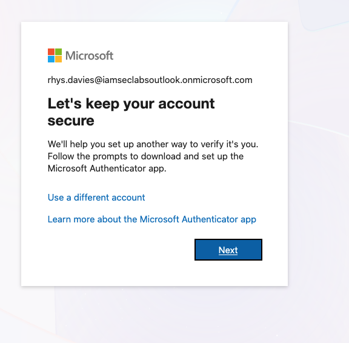

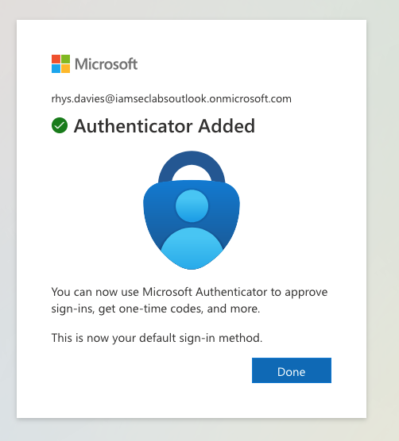
### Self-Service Password Reset (SSPR)

**Business case:** Without SSPR, a user who forgets their password has to wait for helpdesk support. That creates avoidable downtime and support load. SSPR lets users verify their identity and reset their password themselves at any time.

**Security consideration:** SSPR is only as strong as the method used to verify identity. That is why I register MFA as part of the SSPR flow rather than treating it as a separate afterthought. A self-service reset is only safe if the verification method is strong enough.

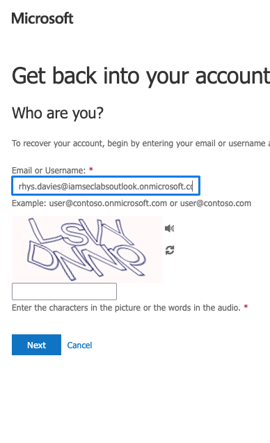

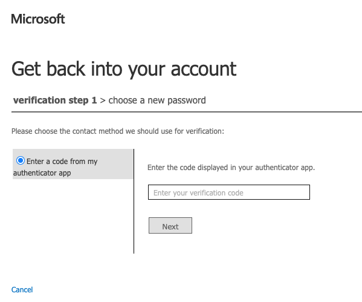

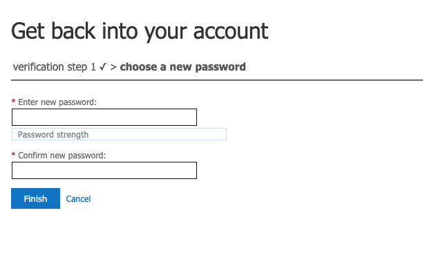

**A security consideration — verification method matters:** SSPR is only as secure as the method used to verify the user really is who they claim to be. Security questions were historically an option, but Microsoft is retiring them for SSPR in March 2027, explicitly because they're "often guessable or susceptible to social engineering, increasing the risk of account takeover during SSPR." This is exactly why the lab registers MFA as part of the SSPR setup process, rather than as a separate step — a self-service reset is only safe if the verification behind it is genuinely strong, since SSPR is, by definition, an unattended process with no human at the helpdesk double-checking the requester's identity.

**Hybrid environments and password policy conflict:** In a hybrid setup, a password reset via SSPR must satisfy both Entra ID's cloud policy and on-premises AD's policy (where writeback is enabled) — if it fails either, the reset fails and the user must fall back to a helpdesk-driven, on-premises reset instead. This creates a genuine design choice for organisations that want a single, unambiguous password policy: rather than running both cloud and on-prem policies side by side, an organisation could choose to disable SSPR and password reset in the cloud entirely, forcing all resets through on-premises AD. This keeps the identity lifecycle strictly single-sourced (matching the "AD as sole source of truth" principle established earlier in this project), at the cost of losing the convenience and reduced helpdesk load SSPR provides.

**Verified finding — licensing is a compliance requirement, not a technical gate:** Tested SSPR successfully on a user without a Microsoft Entra P2 license assigned. Microsoft's general licensing documentation states unlicensed users "may technically be able to access SSPR," though "a license is required for any user that you intend to benefit from the service" — a compliance/entitlement requirement, not a technical enforcement mechanism. This was directly confirmed against Microsoft's own official SC-300 training lab for this exact exercise, which contains no licensing step at all.

**Verified finding — administrator accounts use a separate, legacy SSPR system:** Attempting SSPR on an account holding an administrator role can fail with "password reset isn't turned on for your account," even when SSPR is correctly enabled for all standard users. This is a documented, specific behaviour — administrator accounts use a separate legacy configuration (SSPR-A) distinct from the standard user SSPR settings (SSPR-U) managed through the normal Entra admin center screen, and enabling SSPR for "All users" does not extend to administrator roles.
**Test 1 — Revoke sessions only:** Revoked the user's active session in Entra ID. Confirmed this does not block sign-in — it only forces re-authentication. Signing back in with the same, unchanged password succeeded immediately. Revoking sessions alone is not sufficient containment; it only interrupts current access, not future access.
### Emergency Account Revocation — Hybrid Environment

**Business case:** When an account is suspected of being compromised, the business needs a clear containment process. In a hybrid environment, that means knowing whether the identity is cloud-only or synced, and acting in both places where necessary.

**Approach for a cloud-only user:** Revoking sessions alone is not enough, because the user can usually sign in again. Disabling the account in Microsoft Entra ID is the more effective containment action.

**Approach for a synced user:** The cloud-side action still matters, but the on-premises account also has to be disabled. In this lab, the sign-in method determines the exact behaviour, so the containment approach has to match the authentication model.

**Verification testing:**

**Test 1 — Revoke sessions only:** Revoked the user's active session in Entra ID. Confirmed this does not block sign-in — it only forces re-authentication. Signing back in with the same, unchanged password succeeded immediately. Revoking sessions alone is not sufficient containment; it only interrupts current access, not future access.

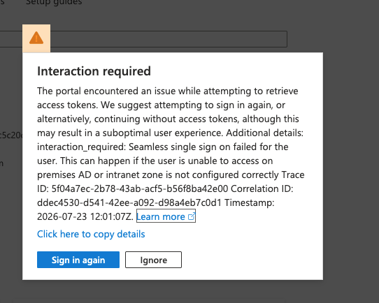

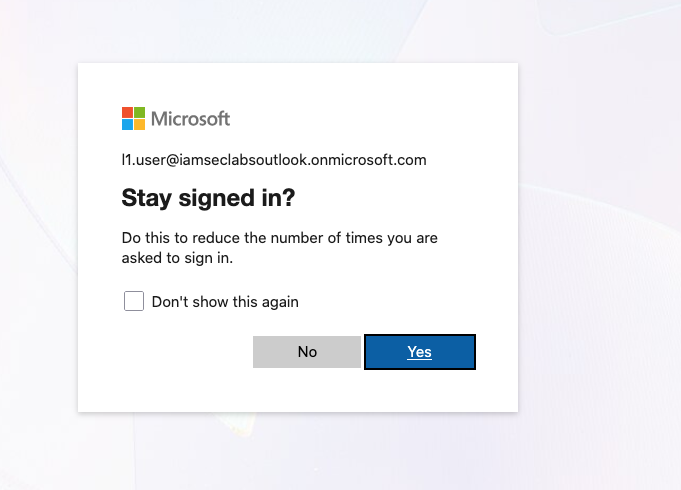

**Test 2 — Disable in the cloud only:** Disabled the account in Entra ID. Confirmed this blocks cloud/portal sign-in entirely ("your account has been locked, contact your support person"). Checking the same account directly in on-premises Active Directory confirmed it remained fully enabled there. For a synced identity, disabling only in the cloud has no effect on-premises, leaving on-premises resources unaffected.

**Test 3 — Disable on-premises, with PTA as the sign-in method:** Re-enabled the account in Entra ID, then disabled it directly in on-premises AD. Attempting to sign in with the correct, known password failed cleanly with "your account or password is incorrect" — the generic error message Microsoft deliberately shows regardless of the actual cause, to avoid revealing to a potential attacker whether the block was due to a wrong password or a disabled account. Re-enabling the account on-premises again immediately restored successful sign-in with the same password, confirming the on-premises disabled status — not the password, and not the cloud-side flag — was the determining factor.

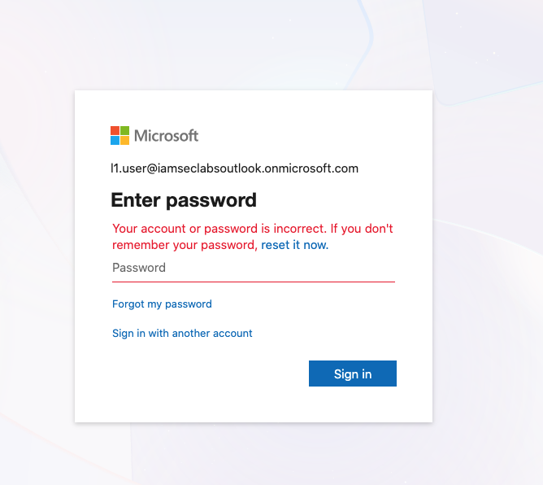

**Why this happened — PTA governs the outcome:** This lab uses Pass-Through Authentication rather than Password Hash Synchronization. With PTA, every sign-in attempt is validated live against on-premises AD, regardless of what the cloud-side enabled/disabled flag shows. This means an account can appear fully "enabled" in Entra ID and still be completely blocked from signing in if it's disabled on-premises — the on-premises status is the true, authoritative check, not the cloud's own record of it.

**Conclusion:** Proper incident containment for a compromised hybrid account requires disabling the account on-premises specifically, not just in the cloud — a cloud-only disable is insufficient with PTA in use, since it only blocks the cloud portal, not the underlying on-premises authentication check performed on every login.

**Note on automation:** In real enterprise environments, this remediation is often automated via SIEM/SOAR tooling (e.g., Microsoft Sentinel playbooks), which can call the Microsoft Graph API to disable an account in Entra ID and, for hybrid identities, use a Hybrid Worker to execute the same disable action directly against the on-premises domain controller. This project performed the same remediation manually, specifically to verify and understand the underlying mechanism directly, rather than relying on automated tooling as a black box.

## Conditional Access

**Business case:** Conditional Access matters because it gives you much finer control than MFA on its own. MFA just adds a second factor, but Conditional Access lets you decide *where* and *for whom* that applies — all users, just privileged accounts, specific locations, specific devices, whatever fits. For example, you could block sign-ins from countries you don't operate in, or require extra authentication specifically for privileged accounts on top of the baseline MFA everyone else has. Microsoft's own mandatory MFA for admin accounts is a good baseline, but it doesn't give you that same level of control — Conditional Access lets you actually tailor policies to the specific users, groups, or risk level you care about, rather than applying one blanket rule to everyone.

**What a business typically needs to control:** This really depends on the organisation's risk appetite and what it's actually protecting — a company handling health records or financial data is going to need tighter controls than one that isn't. A sensible approach is defense in depth, working from the inside out: start with what you can control in your own environment first — your own users, your own devices — before extending controls out to guests, external users, and customers. In terms of the basics, most organisations end up wanting some combination of: enforcing MFA, restricting access by location, applying stronger controls to privileged accounts, and blocking outdated/legacy authentication. This lab builds toward that same kind of baseline, but what you actually configure in a real environment should be shaped by the sensitivity of what you're protecting and how far out from your own environment you're extending control.

**Policy 1 — Require MFA for all users:** I created a Conditional Access policy targeting all users, with the two administrative break-glass accounts explicitly excluded to prevent lockout risk. Scoped to all resources, with a grant control requiring multifactor authentication (the general "Multifactor authentication" strength, not passwordless or phishing-resistant, since this is meant to be the organisation-wide baseline).

**What was built:** I created and saved the policy in Report-only mode first, confirmed it with What If, then switched it on and verified the sign-in logs showed the policy applying correctly.

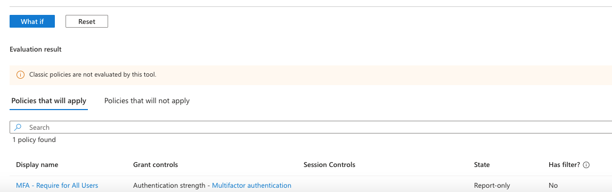

Security Defaults was disabled first, since it can't coexist with an active Conditional Access policy, and the policy was then switched on.

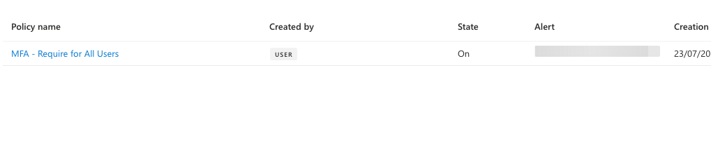

**Verification:** Tested first using the built-in "What If" tool, confirming the policy would apply to a standard test user. Then created a brand-new, non-admin test user with no prior MFA registration.

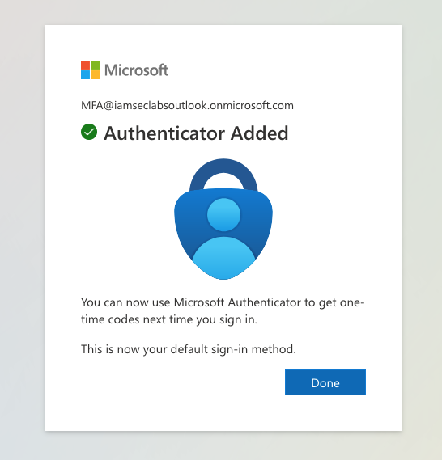

Signed in as this new test user with the policy active — the sign-in correctly prompted for MFA registration and completed successfully.

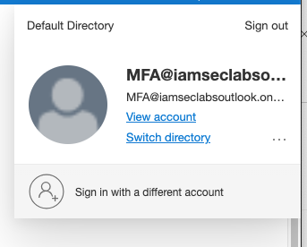

You can check whether a Conditional Access policy is actually being enforced by looking at the sign-in logs — specifically the Conditional Access tab, which shows success or failure for that policy directly. That's what actually confirms whether the policy itself is doing the work, separately from whether MFA happened for some other reason. 

In this case, Security Defaults was already disabled, and Microsoft's own mandatory MFA only applies to admin accounts, not standard users — so checking the sign-in log was the way to actually confirm it was this Conditional Access policy specifically enforcing MFA for a standard user, not something else.

## Identity Governance

**Business Problem:** As a business grows, it ends up with thousands of employees, all doing different things, all needing different authentication and authorization. The problem isn't just setting up access when someone joins — it's knowing, at any point later, whether that access is still correct. 

An employee could have been in the company five years, with permissions granted at various points along the way. How do you know they're still only authorised for what they should be? How do you know they still have access to the right resources, and haven't accumulated access to things they shouldn't? Controls put in place two years ago don't mean anything on their own if nobody's checking whether they're still working, or whether that person's access still matches what their current role actually needs.

**Solution Overview:** Identity Governance is the set of tools and processes — like access packages, access reviews, and PIM — that let a business actually manage and continuously verify this, rather than just setting access up once and assuming it stays correct.

## Privileged Identity Management (PIM)

**Business case:** One of the tools Entra provides for identity governance is Privileged Identity Management (PIM) — a service that lets you manage, control, and monitor access to Entra, Azure, and other Microsoft services. The problem it solves: if someone has a privileged role, like Global Administrator or User Administrator, you don't want them carrying that access all day, every day, if they only actually need it for specific tasks now and then. Standing 24/7 privileged access is a bigger risk than it needs to be.

**How it works:** With PIM, the user is set up as eligible for the role rather than having it permanently active. When they actually need to do a privileged task, they go in, activate the role, and give a business justification for why they need it right now. Once activated, they have that access for a set, limited amount of time. When that time runs out, the access is automatically revoked — if they need more time or need to do something else later, they have to activate it again.

"In general, configuring PIM follows three steps: selecting the scope (Entra roles, Azure resources, or Groups), assigning the role (identity, Eligible or Active, duration), and configuring the role's settings (activation requirements, approval, notifications). The examples below show this applied in practice."

**What was built — Azure resource (Virtual Machine Contributor)**

In Privileged Identity Management, I selected Azure resources, scoped to the relevant resource, then went into Roles and searched for **Virtual Machine Contributor**. I added an assignment for the **Compute Admin** user, setting the type to **Eligible** rather than Active — Eligible means the role is granted but not active until the user deliberately activates it, whereas Active would make it permanent immediately, defeating the purpose of PIM. Duration was set to the maximum allowed (one year).

I then configured the role's settings across the Activation, Assignment, and Notification tabs, covering things like activation duration, justification requirements, and expiry.

To verify, I signed in as Compute Admin, went to PIM → My roles → Azure resources, and activated the Eligible assignment. Once activated, access was granted for the configured time window; if more time was needed, it could be extended from the same screen, and once the window expired, access was automatically revoked.
**Azure resources**
Navigated to Identity Governance → Privileged Identity Management → Azure resources.

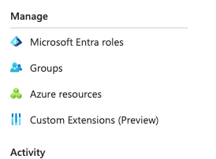

I scoped this to the resource group level, then went into Roles, which manages Azure roles specifically, separate from Entra roles.

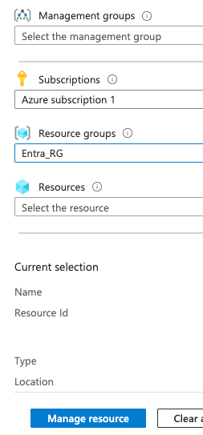

On the Roles page, I searched for the Virtual Machine Contributor role.

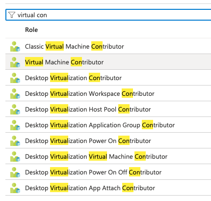

I assigned the Virtual Machine Contributor role to a user.

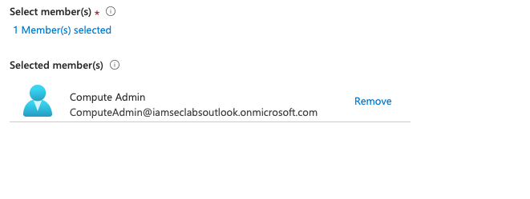

Under the assignment type settings, I set this to Eligible.

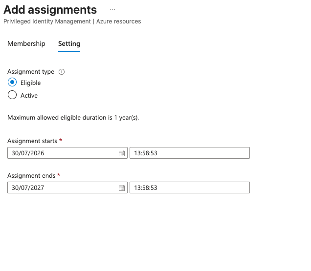

After setting the assignment type to Eligible, I moved into the Settings tab and selected the Virtual Machine Contributor role I'd just assigned. From there, clicking Edit gives access to more granular control — maximum activation duration, what's required to activate (justification, ticket information, approval), and who approves requests if approval is required.

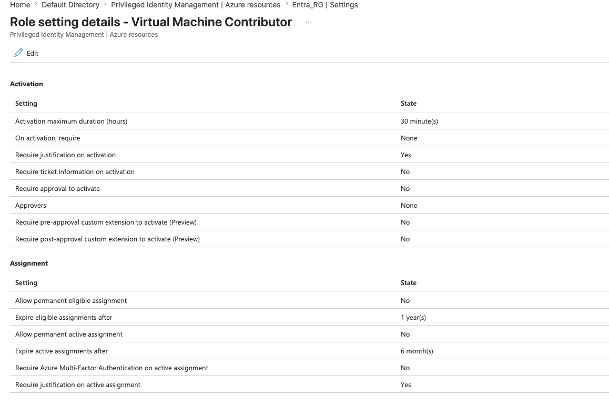

I then signed in to the Azure portal as the Compute Admin user to check what roles had been assigned.

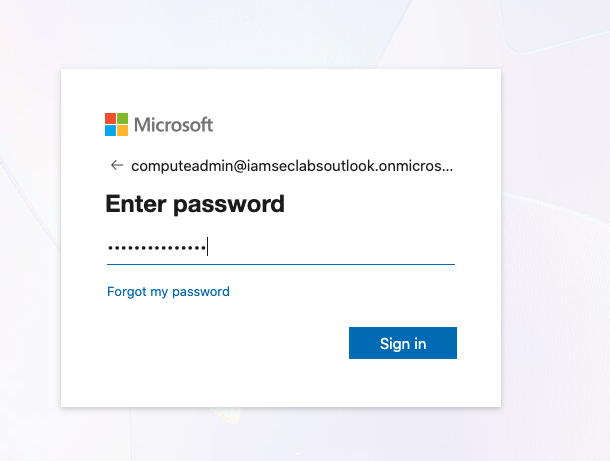

Once signed in, I searched for PIM, went to Roles → My roles, and selected the scope I'd originally configured — Azure resources. Under Eligible assignments, the Virtual Machine Contributor role appeared, ready to activate, with Activate and Extend options available.

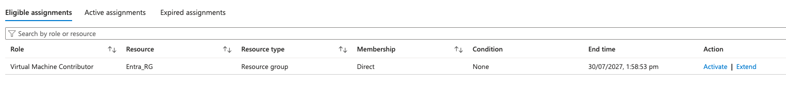

Clicking Activate on the Virtual Machine Contributor role brought up an activation prompt, requiring me to enter a justification for the request. Depending on what was configured in the role settings, this stage might also require MFA or other verification methods. Once submitted, the activation goes through several stages of confirmation before access to the role is actually granted.

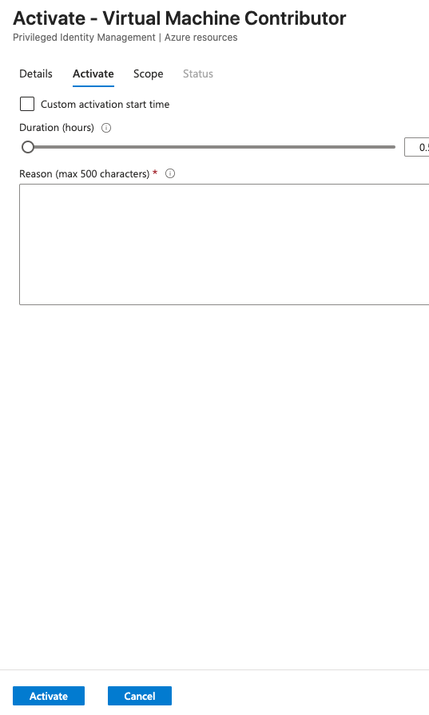

Once activated, access is granted for whatever duration was configured — thirty minutes, an hour, or whatever was set. When that time expires, if more time is needed, clicking Extend allows requesting additional time, again requiring justification if that's configured. Once the session ends, access is automatically revoked and the user reverts back to their normal, unprivileged state.

**What was built — Entra roles (Global Administrator and Security Reader)**

Configuration followed the same underlying process as the Azure resource example above, just approached from the Roles view directly rather than starting from a resource scope. I set up two Entra roles as Eligible: one configured to require the Conditional Access Authentication Context (the same step-up MFA mechanism built earlier), and the other configured to require **Approval** — meaning activation doesn't complete immediately, but instead sends a request that a designated approver (a Global Administrator, in this case) has to review and approve before the role actually activates.

To test this, I signed in as the eligible user and requested activation, then signed in separately as Global Administrator to approve the pending request — confirming the approval workflow genuinely gates activation rather than just logging a request.

**Design consideration — approval overhead and role scoping**

Requiring approval is a genuinely useful extra control, but it isn't something to apply to every role — it introduces real admin overhead, since someone has to be available to review and approve each request. It makes sense for higher-risk roles, but adding it everywhere would create unnecessary friction and slow down routine work.

**What was built — Approval workflow (Global Administrator)**

For roles configured to require approval, whoever is responsible for approving PIM requests goes to Identity Governance → Privileged Identity Management → Microsoft Entra roles → Tasks → **Approve requests**. This screen lists all pending activation requests for roles that need approval. Ticking the relevant request and clicking Approve brings up an approval form, where the approver fills in the details as needed and submits. Once approved, the requesting user can then go and use the role — the approval itself is what completes the activation, rather than the user needing to separately activate again afterward.

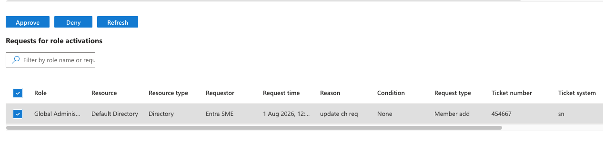

The more important principle when assigning any PIM role is matching the role to the actual job being done, rather than defaulting to something broad like Global Administrator. If someone only needs to reset passwords, Password Administrator or User Administrator is the right fit — not Global Administrator, which carries far more privilege than the task requires. Similarly, someone who only needs visibility into security data should get Security Reader, not a role that grants far more than they need. Giving out excess privilege "just in case" defeats the purpose of PIM's least-privilege model, regardless of how well the activation process itself

## Privileged Identity Management (PIM) for Groups

**Business case:** Rather than assigning a privileged role directly to each individual who needs it, a role-assignable group can hold the actual role instead — as a permanent, always-on assignment. Individual people never hold the role directly, not even in a temporary "eligible" state tied to the role itself. Instead, each person gets eligible *membership* in the group, and it's only through that membership that the role's access ever reaches them, and only for as long as they've actually activated it.

**Why use a group instead of assigning the role to each person individually:**

1. **Scale and consistency** — rather than managing "is this person eligible for Role A, are they eligible for Role B" separately, for every person and every role, you manage one thing: who's eligible to be a member of this one group. Add or remove someone from the group, and their access changes automatically, without touching individual role assignments one at a time.

2. **A genuine security protection, not just convenience** — a role-assignable group can only be managed by a Global Administrator, a Privileged Role Administrator, or the group's own Owner. Nobody else — not even roles like Helpdesk Administrator or User Administrator, which could normally manage an ordinary group. This closes a real privilege-escalation risk: without this protection, a lower-privileged admin could potentially add themselves into a group that happens to hold a powerful role, effectively promoting themselves sideways. This protection only exists for role-assignable groups specifically — not ordinary security groups.

**A fixed constraint worth knowing:** role-assignable groups must be cloud-only, static security groups. They can't be dynamic, and they can't be synced down from on-premises AD.

**What was built:**

1. Created the group — set an Owner, ticked "Microsoft Entra roles can be assigned to the group" (this has to be done at creation — it can't be added afterward), and assigned the desired Entra role to the group at that same step.

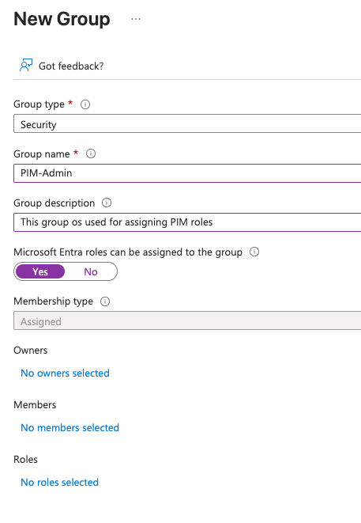

2. Brought the group under PIM management via Identity Governance → Privileged Identity Management → Groups. The new default screen didn't show a working "Discover groups" option, so switched to the legacy experience via the banner link. From there: Discover groups → selected the created group → Manage groups → confirmed.

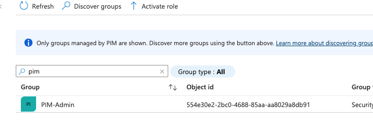

3. The group now appears in PIM's list of managed groups. Edited the role settings separately for Member and Owner — Eligible vs. Active, maximum duration, authentication requirements — using the same three-tab structure (Activation, Assignment, Notification) already used for Azure Resource roles and Entra ID roles.

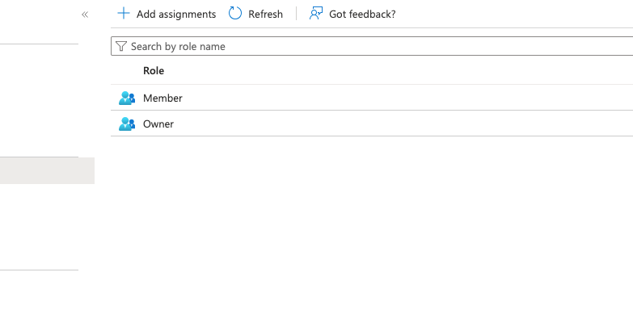

4. Under Roles, there are two entries — Member and Owner. Added assignments for each, configuring who can be eligible or active as Owner, and who can be eligible or active as Member.

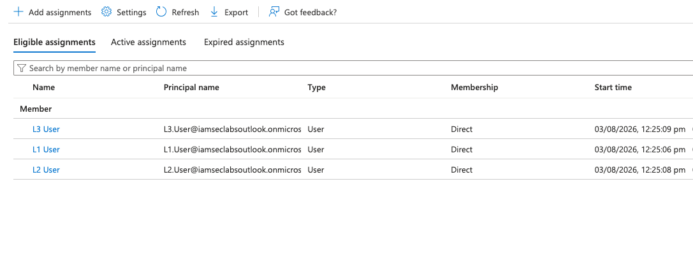

**Note on documentation currency:** the "Discover groups" workflow above is Microsoft's documented, legacy approach. At the time of writing, Microsoft had rolled out a newer default Groups experience in PIM with no equivalent documentation yet available — the legacy view had to be used specifically to complete this configuration, since the new screen's equivalent action couldn't be located or confirmed.

## PIM Governance Matrix — A Standardised Approach to Role Configuration

**Business case:** Without a documented standard, every PIM role ends up configured slightly differently, based on whichever admin happened to set it up and their own judgement at the time. One admin might configure Global Administrator with an 8-hour activation window and no approval; another might configure it correctly with a 1-hour window and dual approval. That inconsistency is a genuine governance risk — an auditor asking "what's your organisation's policy for privileged access" deserves one clear, consistent answer, not "it depends who configured it." A PIM governance matrix solves this by defining, in advance, exactly what settings apply to each role, so every future configuration follows the same standard rather than being decided ad hoc.

**Example matrix, based on realistic enterprise roles:**

| Role | Assignment Type | Activation Duration | MFA on Activation | Approval Required | Approver(s) | Justification Required |
|---|---|---|---|---|---|---|
| Global Administrator | Eligible only | 1 hour | Yes (phishing-resistant) | Yes | 2 other Global Admins | Yes |
| Privileged Role Administrator | Eligible only | 2 hours | Yes | Yes | Global Admin | Yes |
| User Administrator | Eligible only | 4 hours | Yes | No | — | Yes |
| Helpdesk Administrator | Eligible only | 8 hours | Yes | No | — | Yes |
| Exchange Administrator | Eligible only | 4 hours | Yes | No | — | Yes |
| Reader (subscription-wide) | Active permitted | N/A (standing) | No | No | — | No |

**Why the settings differ by role, not just by preference:** the highest-consequence role (Global Administrator) gets the shortest activation window and the strictest verification, since the potential damage from a compromised or misused session is greatest. A read-only role like Reader carries little risk even if left standing, so the overhead of activation and MFA isn't proportionate to the risk. Justification is required even for lower-risk roles, since an audit trail of who requested access and why has value regardless of whether the role needed formal approval to grant.

**The point of this matrix:** it isn't just a record of settings — it's the standard every future PIM configuration in the organisation should be checked against, so privileged access decisions are made consistently, by policy, rather than inconsistently, by whichever admin happens to be configuring it that day.

## Alerts

**Business case:** In a large enterprise environment, there's a huge amount happening at any given time — roles being assigned and unassigned, privilege creep building up quietly, identities joining, moving, and leaving constantly. It's genuinely not possible for a person to manually track all of this activity across the environment in real time. What's needed is a way to get a snapshot of what's actually happening — not by watching everything constantly, but by having the system flag specific, defined conditions automatically, so a human only needs to step in when something's actually worth looking at.

**Solution:** PIM alerts solve this by monitoring the environment automatically and flagging specific, defined conditions as they happen — things like too many Global Administrators, roles being assigned outside of PIM, eligible administrators not activating their roles, or potential stale accounts sitting in a privileged role. An analyst can configure these alerts once, then rely on the dashboard to surface what's actually happening across the environment, rather than manually checking everything themselves.

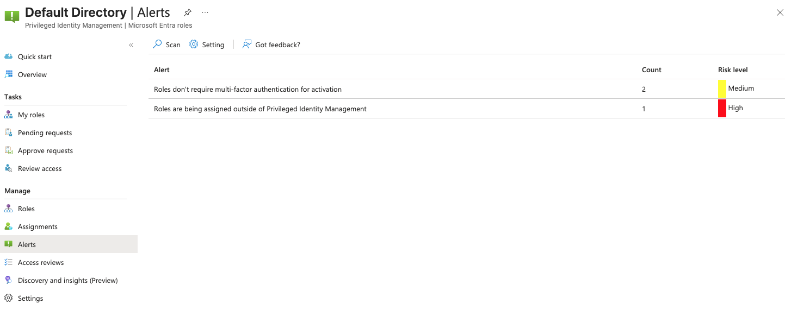

What alerts give you is the *what* — a factual, real-time signal that something worth investigating has occurred. They don't tell you the *why*. That's where the investigation continues: an alert is the trigger that leads to a targeted access review, which is the mechanism for actually getting to the reason behind what the alert flagged.

**Business value:** Alerts reduce attack surface by surfacing potential gaps quickly, rather than leaving them to accumulate unnoticed until an audit or incident forces the question. They also reduce overhead — analysts don't need to manually search the environment for problems, since relevant conditions are already surfaced directly on the dashboard. This lets an analyst quickly assess what's relevant, raise a targeted access review where needed, and remediate the underlying issue — reducing attack surface and improving overall security posture, without the manual effort of finding these problems from scratch.

# Entitlement Management

## Business Problem: Manual Access Provisioning at Enterprise Scale

In a large enterprise with many employees, people are constantly joining, moving between roles, and leaving. When someone joins, they're typically granted a baseline of resources automatically — Microsoft 365, Teams, Outlook, email — since most employees need these to do their day-to-day work. Beyond that baseline, further access is usually granted based on department and role.

The problem arises when someone needs access to a resource outside their normal baseline — something required for a specific task, not an ongoing part of their role. One way to handle this is manually: the employee asks someone for access, and that person grants it. For smaller organisations, this manual process may be perfectly workable.

## Solution

The solution to this business problem is implementing a feature from Identity Governance called Entitlement Management. When an employee is onboarded, they're granted access to the baseline resources they need. When they later require additional access to complete a specific task, they can go into the portal, request and provision that access, use the resource, and then step away — rather than holding standing access they don't need around the clock. They request access, complete the task, and the access doesn't remain indefinitely.

## Business Value

Automating this process through Entitlement Management reduces overheads and administrative burden. It removes the delay caused by employees having to request access and wait for manual approval — a process that slows down productivity.

## Pros and Cons

### Pros (of using Entitlement Management)

- Automates the access workflow, reducing friction and administrative overhead.
- Increases productivity, since nobody has to stop and wait for manual approval before getting the access they need.

### Cons (of using Entitlement Management)

- Not necessary for smaller businesses with fewer employees — the overhead of manual provisioning may not justify implementing it.
- Many companies don't use Entitlement Management, relying on PIM instead.
- Requires a Microsoft Entra ID Governance (or Entra Suite) subscription, with some capabilities available under Entra ID P2 — carrying a cost implication for smaller organisations.

## Troubleshooting & Problems I Hit

### 1) Reader roles assigned, but user had no access

**Problem:**
I assigned the test user (L1) Reader roles in both Entra ID and at the Azure subscription level, but when I signed in as L1, I couldn't see any existing resources. Azure even acted as if the account had no relationship to the subscription at all and prompted me to start a new free trial.

**Investigation:**
I checked the role assignments directly and found that both roles had been created as Eligible rather than Active. That pointed to PIM being involved rather than a simple permissions issue.

**Cause:**
An Eligible assignment means the user is allowed to activate the role, but the role is not actually in effect until it is manually activated. Since nothing had been activated, L1 genuinely had no access.

**Fix:**
I removed both eligible assignments and reassigned them as Active. Once that was done, the access took effect immediately, and I confirmed it by signing in as L1 and successfully seeing the existing VM.

**Lesson learned:** Having a role assigned in PIM doesn't mean you actually have access — Eligible just means you're allowed to activate it. You still have to activate it before it's actually usable.

### 2) SSPR failed with password reset not enabled

**Problem:**
When I attempted SSPR on a standard test user account, I got the message: "You can't reset your own password because password reset isn't turned on for your account."

**Investigation:**
I checked the configuration and confirmed that SSPR had not been properly enabled and saved for that user at that point.

**Cause:**
The user simply wasn't correctly included in the password reset configuration.

**Fix:**
I enabled password reset for the user properly and then tried again.

**Lesson learned:** SSPR only works if the target user or group is actually configured correctly — if that's wrong, nothing else matters, it just fails.

### 3) MFA verification code not received during SSPR

**Problem:**
While completing SSPR, I was prompted to enter a verification code, but the push notification did not arrive on the authenticator app.

**Investigation:**
I checked mysignins.microsoft.com and confirmed that the authenticator app registration was showing correctly and matched to the correct device. Even so, the push notifications still were not working.

**Cause:**
The precise root cause was not confirmed at the time. One likely explanation was that MFA had originally been set up separately, before the SSPR process was configured, and that the registration ended up in an inconsistent state.

**Fix:**
I deleted the existing authenticator app registration completely and then re-registered from scratch. After that, the push notifications worked and the password reset completed successfully.

**Lesson learned:** Sometimes the quickest fix really is just deleting the registration and starting again clean. It also taught me to check whether a registration is actually healthy, not just whether it exists.

### 4) Root cause of SSPR failure identified through re-testing

**Problem:**
After troubleshooting the SSPR issue, I wanted to confirm what had actually caused the verification code and password reset problems.

**Investigation:**
I formed two hypotheses: first, that the authentication method targeting had not been configured correctly; and second, that MFA and SSPR registration had not been completed together in one continuous flow. I removed the existing authenticator registration, then went into the Authentication Methods Policy, confirmed Microsoft Authenticator was enabled, and explicitly targeted the SSPR test group rather than relying on the top-level summary. I then registered MFA and completed SSPR together in a single flow.

**Cause:**
Because I changed both variables at once, I can't say with certainty which one was the exact cause. What I can confirm is that the explicit targeting and the single-flow registration both produced a clean result.

**Fix:**
I set the authentication method target properly and completed MFA and SSPR registration in one continuous process.

**Lesson learned:** I changed two things at once, so I can't say for sure which one actually fixed it. Good reminder not to trust a top-level summary alone, and that the order you register things in can genuinely matter.

### 5) Sign-in failure mistaken for wrong password

**Problem:**
A sign-in attempt failed even though I knew the password was correct.

**Investigation:**
I checked the user's sign-in logs directly and saw that the failed attempt was recorded as single-factor authentication. Since Security Defaults enforces MFA tenant-wide, I realised this was the account's first sign-in and MFA had never been registered.

**Cause:**
The real issue was not the password or the account state — it was missing MFA registration.

**Fix:**
I signed in again, which correctly triggered the MFA registration flow, and the issue was resolved.

**Lesson learned:** The sign-in logs told me more than the error message did. In IAM, you have to go by the evidence, not just assume.

## References

Key Microsoft documentation used to verify technical claims in this project:

- [Active Directory Domain Services Overview](https://learn.microsoft.com/en-us/windows-server/identity/ad-ds/get-started/virtual-dc/active-directory-domain-services-overview)
- [Install Active Directory Domain Services](https://learn.microsoft.com/en-us/windows-server/identity/ad-ds/deploy/install-active-directory-domain-services--level-100-)
- [Microsoft Entra Connect: Prerequisites and Hardware](https://learn.microsoft.com/en-us/entra/identity/hybrid/connect/how-to-connect-install-prerequisites)
- [Microsoft Entra Connect Sync: Get Started Using Express Settings](https://learn.microsoft.com/en-us/entra/identity/hybrid/connect/how-to-connect-install-express)
- [Password Policy Overview and FAQ](https://learn.microsoft.com/en-us/entra/identity/authentication/tutorial-password-policy-overview-frequently-asked-questions)
- [On-premises Password Writeback with SSPR](https://learn.microsoft.com/en-us/entra/identity/authentication/concept-sspr-writeback)
- [Pass-Through Authentication FAQ](https://learn.microsoft.com/en-us/entra/identity/hybrid/connect/how-to-connect-pta-faq)
- ## References (MFA & SSPR)

- [Configure Security Defaults for Microsoft Entra ID](https://learn.microsoft.com/en-us/entra/fundamentals/security-defaults)
- [Enable Microsoft Entra Self-Service Password Reset](https://learn.microsoft.com/en-us/entra/identity/authentication/tutorial-enable-sspr)
- [Enable Microsoft Entra Password Writeback](https://learn.microsoft.com/en-us/entra/identity/authentication/tutorial-enable-sspr-writeback)
- [Self-Service Password Reset Licensing](https://learn.microsoft.com/en-us/entra/identity/authentication/concept-sspr-licensing)
- [Self-Service Password Reset Deep Dive](https://learn.microsoft.com/en-us/entra/identity/authentication/concept-sspr-howitworks)
- [Troubleshoot Self-Service Password Reset](https://learn.microsoft.com/en-us/entra/identity/authentication/troubleshoot-sspr)
- [Password Policy Overview and FAQ](https://learn.microsoft.com/en-us/entra/identity/authentication/tutorial-password-policy-overview-frequently-asked-questions)
- [Security Questions Authentication Method (Retirement Notice, March 2027)](https://learn.microsoft.com/en-us/entra/identity/authentication/concept-authentication-security-questions)
- [Microsoft Entra Administrators Can't Reset Their Own Password from Cloud (SSPR-A vs SSPR-U)](https://learn.microsoft.com/en-us/troubleshoot/entra/entra-id/user-prov-sync/password-writeback-error-code-sspr-009)
- [SC-300 Official Lab: Configure and Deploy Self-Service Password Reset](https://microsoftlearning.github.io/SC-300-Identity-and-Access-Administrator/Instructions/Labs/Lab_09_ConfigureAndDeploySelfServicePasswordReset.html)

*Note: the information above reflects Microsoft's documentation and product behaviour at the time this project was built. Microsoft Entra and Azure features are updated frequently, so some specifics may have changed since — the underlying identity and access management concepts, however, remain the core focus of this project.*

*(More references to be added as Conditional Access, MFA, and PIM sections are completed.)*
